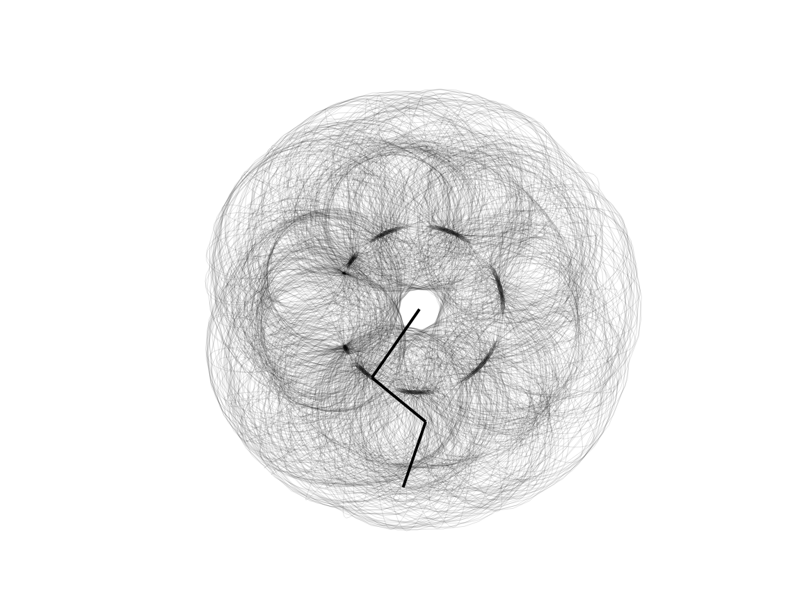

# Arm Trail Art

A mesmerizing generative art animation that creates beautiful, organic patterns through interconnected rotating arms.



## Features

- **Hypnotic patterns**: Watch as three connected arms trace elegant, non-repeating designs
- **Pure JavaScript**: No dependencies, just vanilla JS and HTML5 Canvas
- **Customizable**: Easy to modify frequencies, lengths, and colors to create unique patterns
- **Lightweight**: Runs smoothly at 60 FPS in any modern browser

## Quick Start
```bash
# Clone the repository
git clone https://github.com/Wilsawn/arm-trail-art.git

# Navigate to the project
cd arm-trail-art

# Open in browser
open index.html
```

Or simply download the files and open `index.html` in your browser.

## How It Works

The animation uses a hierarchical system of three rotating arm segments:

1. **Base Arm**: Anchored at screen center, rotates using `sin(angle * 0.739)`
2. **Middle Arm**: Connected to base, rotates with `cos(angle * √3)`
3. **End Arm**: Connected to middle, rotates with `sin(angle * π)`

Each arm rotates at mathematically chosen frequencies (using irrational numbers) to create non-repeating, harmonograph-like patterns. The endpoint traces a semi-transparent trail that builds intricate designs over time.

## Customization

Edit `main.js` to create your own unique patterns:
```javascript
// Modify arm lengths
var arm1 = Arm.create(width / 2, height / 2, 120, 0);  // Change 120
    arm2 = Arm.create(arm1.getEndX(), arm1.getEndY(), 100, 1.3);  // Change 100
    arm3 = Arm.create(arm2.getEndX(), arm2.getEndY(), 100, 1.3);  // Change 100

// Adjust rotation frequencies and amplitudes
arm1.angle = Math.sin(angle * 0.739085133) * 2.7;  // Tweak these values
arm2.angle = Math.cos(angle * Math.sqrt(3)) * 1.91;
arm3.angle = Math.sin(angle * Math.PI) * 3.17;

// Change animation speed
angle += 0.02;  // Lower = slower, higher = faster

// Modify trail appearance
tctx.strokeStyle = "rgba(0,0,0,0.12)";  // Change color/opacity
tctx.lineWidth = 1;  // Change thickness
```

## Project Structure
```
arm-trail-art/
├── index.html    # HTML structure and styling
├── arm.js        # Arm object definition
├── main.js       # Animation loop and logic
├── demo.png      # Example output
└── README.md     # This file
```

## Inspiration

This project is inspired by harmonographs and spirographs - mechanical devices that create geometric patterns through the combination of circular motions.

## License

MIT License - feel free to use this project however you'd like!

## Contributing

Contributions are welcome! Feel free to open an issue or submit a pull request.

---

**Enjoy the mesmerizing patterns!** Star this repo if you find it interesting!